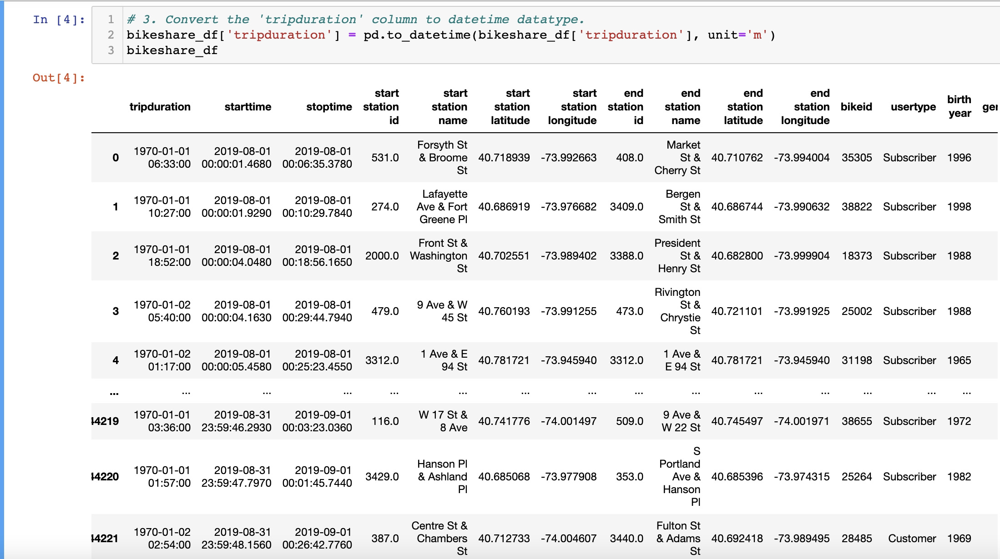
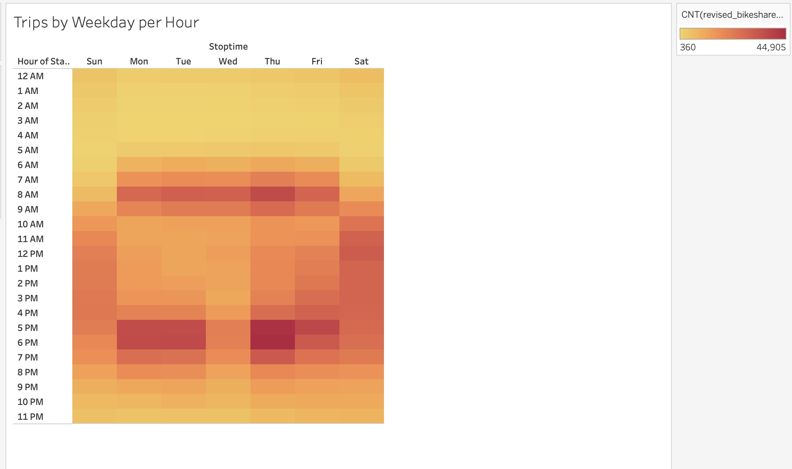
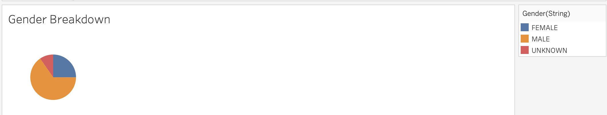
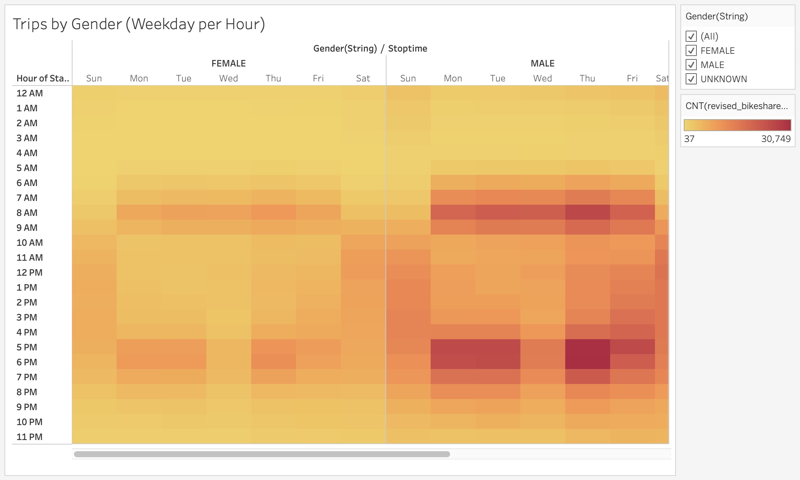
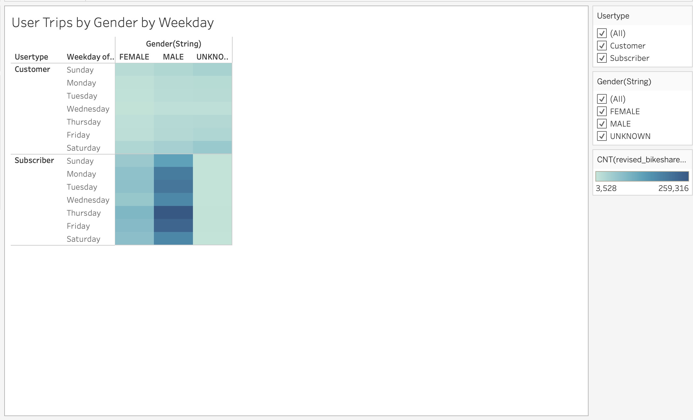
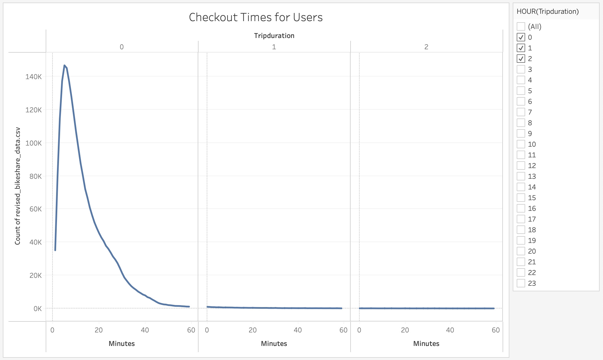
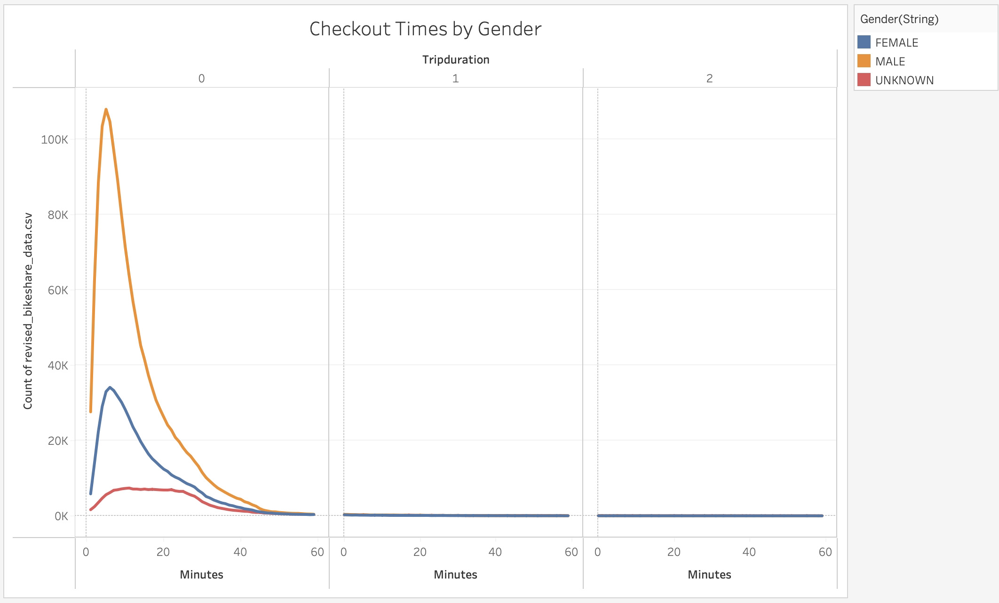

# Bikesharing
From Pandas, create a set of visualizations for bike trip analysis using Tableau.

# Overview of the Statistical Analysis
The first task we were given was to convert one of the columns from an integer to a datatype, using Pandas. With the revised data, we would create a set of visualizations that would show the length of time that bikes are checked out for all riders and genders. The visualizations made should also show the number of bike trips for all riders and genders  for each hour of the day of the week as well as the number of bike trips for each type of user and gender for each day of thhe week. All the visulaizations are to be used for the final presentation and analysis to pitch to investors.

# Results
## The Revised Dataframe 
The image below shows what the revised dataframe looks like. The initial dataframe used integers for the "tripduration" column and has been formatted as a datetime object.

## The Visualizations Used for The Bikeshare Analysis
The data for the month of August from NYC's Citi Bike, which is one of the best bike sharing programs according to various articles online, was used in creating the different visulaizations for (this) analysis.

* The Number of Trips

There were 2,344,224 bike-share trips for the month of August in NYC.

* Number of Trips by Weekday per Hour

From Mondays to Fridays, the hours between 7AM to 9AM as well as 5PM to 7PM have the most number of trips, with Thursday having the highest numbers in these two given time frames and Wednesdays between 5PM to 7PM have the least. On Saturdays and Sundays, between 10 AM to 4PM, there are more bike trips compared to the rest of the days of the week. Of the two days, there are more bike-share trips on Saturday, specifically around noon.

* Gender Breakdown 

1,530,272 or about 65% of the trips were done by males, 588,431 or 25% by women and 255,521 or about 5% are unknown.

* Number of Trips by Gender (Weekday per Hour)

This visualization is consistent with the Number of Trips by Weekday per Hour visualization while at the same time reflecting the trips by gender. However what is noticable is for the 'unknown' there are more bikeshare trips made by them on Saturdays and SUndays than the rest of the week.

* User Trips by Gender by Weekday

Thursdays and Fridays have the highest subscriber trips, while Wednesdays and Sundays are the lowest. What was interesting was that females have Saturday-Tuesday-Monday, in terms of highest to lowest bikeshare use-in order after Friday, while their male counterparts had Tuesday-Monday-Saturday.
This is the order by which non-subscribers'(which makes up about 19%) bikeshare trips arranged range from highest to lowest number per weekday: Saturday, Sunday, Friday, Thursday, Monday, Tuesday and Wednesday. 

* Checkout Times for Users

More than 90% of the trips last less than an hour or sixty minutes. 1,815,032 or almost 77% of the trips last 20 minutes or less. 1,147,952 or about 49% of trips last 10 minutes or less and The highest number of trips in terms of checkout time was for 5 minutes at 146,672.

* Checkout Times by Gender

The tripduration by males and females more or less follow the same increasing/decreasing trend for each minute, specifically in the first hour. 
The gender labeled as 'unknown' however does not have a noticeable 'peak' compared to their male and female counterparts. The tripduration by this group ranges somewhere between 6,000 to 7,000 within the 6 minute to 26 minute time frams.

* The complete presentation can be accessed by clicking the link.
[click_me!](https://public.tableau.com/app/profile/richelle.long/viz/RKLong_NYCBikeshare/NYCBikeshare-UsersandTripdurationfortheMonthofAugust)

# Summary

For the month of August, there were about 2,344,224 bikeshare trips made. The highest number of bike trips coincide with the rush hour traffic of the weekdays which is between 7AM to 9AM and 5PM to 7PM. The weekends are the least busy days of the week in terms of bike trips, but the hours in which the bike trips occur are between 10 AM to 4 (extending much later for males), which are the not-so-busy hours during the work-week. I think it's safe to assume that during the weekend the bikes are predominantly used for running errands or for leisure instead of commuting for work. More than 80% of these trips were made by subscribers to the program while the rest were pay-per-use customers. In terms of tripduration, a majority of the trips lasted 10 minutes or less. 

I think it would be a good idea to take a look at the checkout times per weekday. I think this would help in establishing the location and number of bike stations that need to be established in the city.

Another thing that might be interesting to look at is the age(by range and not individually) of users per time of day per weekday(or even per individual day, if possible). Although we have created a visualization for age vs tripduartion, which I opted not to use, I think it would be more useful to modify it in terms of age ranges, than actual age. Again, this would help determine the location and number of bike stations as well as the purpose of bike use -- will it be for work, for leisure activities, etc.

